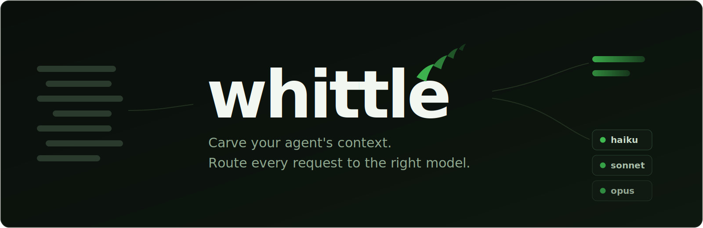

# 🪓 whittle

**Carve your agent's context down to what matters. Lossless or clearly marked, code never touched.**

*Optionally, route each request to the cheapest model that can handle it. Local, fail-open, and every claim in this README regenerates from a clone.*

[](https://github.com/firstops-dev/whittle/actions/workflows/ci.yml)
[](https://github.com/firstops-dev/whittle/releases)
[](https://pkg.go.dev/github.com/firstops-dev/whittle)
[](LICENSE)



<p align="center">
  <strong><a href="#install">Install</a></strong> ·
  <strong><a href="#see-it">How it works</a></strong> ·
  <strong><a href="docs/compression.md">Compression</a></strong> ·
  <strong><a href="docs/ROUTER.md">Model routing</a></strong> ·
  <strong><a href="bench/README.md">Benchmarks</a></strong> ·
  <strong><a href="docs/why-whittle.md">Why whittle?</a></strong>
</p>

Long agent sessions drown in tokens, and most compressors buy their ratio by silently destroying what agents need: array rows vanish, file reads get gutted, identifiers come back mangled. Whittle holds one line: **lossless or clearly marked, code never touched, every anomaly fails open to the original bytes.**

Built for engineers running long Claude Code sessions who refuse to trade fidelity for token savings.

## Highlights

- 🪓 **Write-time compression**: a Claude Code PostToolUse hook whittles each tool output *before* it enters context, so the savings repeat on every later turn. History is never mutated, so prompt caches stay intact.
- 🔒 **Lossless or marked**: JSON reshapes byte-exact (rows are never dropped), logs keep every error plus an honest `[N lines omitted]`, source code passes through untouched.
- 🎯 **Token-honest numbers**: savings measured against calibrated tokenizer counts, not byte counts that overstate by up to 4×.
- 🧭 **Opt-in model router**: hard reasoning stays on your strongest model, trivia drops to the cheapest, per one auditable policy file driven by trained-classifier signals ([how it works](docs/ROUTER.md)).
- 🛟 **Fail-open, local, yours**: if whittle is down your agent runs on originals, a rejected rewrite retries your original request, zero credentials leave your box, and the Go binary has zero external dependencies.

## Install

```sh
go install github.com/firstops-dev/whittle/cmd/whittle@latest
whittle setup      # hook + local daemon + optional ML sidecar, one command
```

Tool outputs are whittled from now on; `whittle stats` shows what you're saving. (Homebrew: `brew install firstops-dev/tap/whittle`. If `go install`'s binary isn't found, add `~/go/bin` to your PATH. Linux runs the daemon under systemd, see [notes](docs/compression.md).)

**Optional: turn on model routing.**

```sh
whittle policy init                              # calibrated policy, your model ids auto-detected
whittle route -install                           # background service (or `whittle route` in a terminal)
export ANTHROPIC_BASE_URL=http://127.0.0.1:45873
```

## See it


```
$ whittle compress -stats demo/build.log
... [59 lines omitted]
2026-07-04T10:00:58Z INFO  compiling module pkg/058 ok (406ms)
2026-07-04T10:00:41Z ERROR migrate failed: relation "users" does not exist
... [79 lines omitted]
2026-07-04T10:02:19Z ERROR shutdown: connection reset by peer
2026-07-04T10:02:20Z INFO  144 ok, 2 errors

whittle: action=compressed detected=log strategy=ansi_strip+log_compressor tokens=4728->163
```

Both errors, their context, and the summary survive; 138 lines of noise collapse into two counted markers. Across **5,000 real agent sessions**: **22% tool-output reduction at zero measured information loss**: mechanically lossless on 15,846/15,846 items, and a blinded 4-judge panel found 0/120 material loss on the lossy prose path. Full receipts, including an honest side-by-side against headroom: [bench/](bench/README.md).

## Compression: what happens to each content type

JSON is reshaped **losslessly** (byte-exact reconstruction). Logs and terminal streams are cut lossily but **marked and exactly accounted**. Markdown file reads keep code fences, tables, and headings byte-exact while prose is compressed by an optional local model with fidelity guards. Source code is **never touched**. Every path is guarded: the worst case is always *not compressed*, never *corrupted*.

The full per-type contract, ML prose path, architecture, and performance tables: [docs/compression.md](docs/compression.md) · what each guarantee is pinned by: [GUARANTEES.md](GUARANTEES.md).

## Model routing (opt-in)

Whittle's second surface: a local proxy on `ANTHROPIC_BASE_URL` that sends each request to the cheapest model tier that can still handle it, per a policy you can read in one screen.

- **Calibrated out of the box**: `whittle policy init` writes a conservative default (hard reasoning → strongest tier, confident chit-chat → cheapest, *everything else untouched*) with your account's real model ids auto-detected. [What it does & how to customize](router/policies/default.md).
- **Multi-signal, not keyword-matching**: a trained 14-subject classifier (probability-mass thresholded, so an *uncertain* classification never escalates), a contrastive difficulty score, and your own keywords. Every log line shows each signal's value against its gate.
- **Rewrites the model, never your history**: prompt-cache prefixes survive; capabilities the cheaper model rejects are stripped automatically; credentials pass through untouched.
- **Never blocks you**: bad policy, dead classifier, or a rejected rewrite all fall back to your original request. Unset the env var and you're direct again.
- **Savings you can measure**: every request logs requested model, served model, and real token usage.

The router itself (engine, policy design, signal composition) is whittle's own; two pretrained models power its ML signals (the 14-subject `domain` classifier and the text embedder, both from [vLLM Semantic Router](https://github.com/vllm-project/semantic-router)). Architecture, signal math, and precise credits: [docs/ROUTER.md](docs/ROUTER.md).

## Why write-time?

Most context compressors are read-time proxies: they rewrite your conversation history on every LLM call, which breaks prompt caches, terminates your API traffic, and makes lossy compression the default. Whittle compresses each output **once, at the moment it's born**, before it enters history: savings compound across every later turn, and nothing sits in your request path.

| | whittle | read-time compressors |
|---|---|---|
| compresses | once, at write time | re-runs on every LLM call |
| prompt cache | intact, history never rewritten | invalidated by history rewrites |
| your request path | nothing resident in it | a proxy that must stay up |
| loss model | lossless or marked | lossy by default, recover on demand |
| cost of failure | original bytes | a broken or blocked call |

The full argument, and why routing is a different kind of proxy: [docs/why-whittle.md](docs/why-whittle.md).

## FAQ

**Will it break my agent?** No, and that is the core design constraint. Every path fails open: if whittle is down, declines, or errors, your agent sees original bytes. The router likewise: worst case is your request untouched.

**Does it need Python?** No. The deterministic compressors (JSON, logs, terminal, markdown structure) are pure Go. Python powers the *optional* prose model and router classifiers; `whittle setup` installs it if `python3` exists, and everything else works without it.

**Are token savings dollar savings?** Not 1:1. Under prompt caching, cheap cache-reads dominate the bill, so a 22% token cut is roughly 3–5% of session cost. We publish both numbers rather than pretending otherwise: [bench/](bench/README.md).

**How does it compare to headroom?** On identical bytes, headroom's defaults compress ~5 points more, by dropping rows whittle refuses to drop. On conversation-shaped content whittle leads *while staying lossless*. Which trade you want is the whole point: [bench/SIDEBYSIDE.md](bench/SIDEBYSIDE.md).

**Where does my data go?** Nowhere. Hook, daemon, models, and router all run on your machine. The router forwards your own credentials to Anthropic and logs token *counts*, never prompt text.

**Which agents?** Claude Code today (hook + router). Cursor, Codex, and OpenCode adapters are on the roadmap; the compression engine is also a plain Go library and HTTP service.

## Verify it yourself

Every claim here is checkable from a clone; that is the point.

```sh
make test                          # guarantees as executable tests (GUARANTEES.md)
go run ./bench                     # corpus reductions + fidelity, SHA-pinned, CI-gated
python bench/calibrate_tokens.py   # reproduces the token-estimator MAE
```

## Contributing

The bar: guarantees are executable, see [CONTRIBUTING.md](CONTRIBUTING.md). Fidelity bugs (whittle changing an output's meaning) are treated as urgent.

Near-term roadmap: a tagged release that ships the router, agent adapters (Cursor, Codex, OpenCode), Linux packaging. Good first issues: adapters, packaging, detection corpus cases.

## Acknowledgments

Whittle's log-selection strategy, several detection heuristics, and the tabular parser were adapted from [Headroom](https://github.com/headroomlabs-ai/headroom) (Apache-2.0); their compaction work is excellent; we wanted the write-time position and the stricter fidelity contract it demands. The router's two pretrained models (the `domain` classifier and the text embedder behind the similarity signals) come from [vLLM Semantic Router](https://github.com/vllm-project/semantic-router) ([whitepaper](https://vllm-semantic-router.com/white-paper)); the routing engine and policy design are whittle's own. See [NOTICE](NOTICE).

If whittle's fidelity contract is the trade you want, a ⭐ helps other agent users find it.

## License

Apache-2.0.
